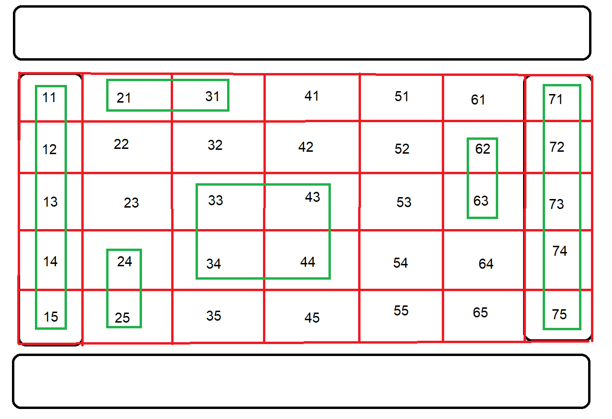

# Project Photo-Gallery 📷
Welcome and thank you for visiting my project.

I enjoyed creating it and I learned some useful tricks about grid structures as well as creating multiple layers for additional effects.  
This type of project also gave me the opportunity to add two of my own pictures into the mix.  
You can see those two pictures left and right as they show the <a href="https://en.wikipedia.org/wiki/Heterochromia_iridum">two different eyes</a> of my dog.

Table of Contents 
<ol>
  <li><a href="#about-the-project-">About The Project</a></li>
  <li><a href="#key-features-">Key Features</a></li>
  <li><a href="#planning-prototyping--production-">Planning, Prototyping & Production</a></li>
  <li><a href="#contributors-">Contributors</a></li>
  <li><a href="#resources-used-">Resources Used</a></li>
  <li><a href="#lessons-learned-">Lessons Learned</li>
  <li><a href="#license-">License</li>
</ol>

## About the project 📘

While studying to improve my web development skills this is the first project work on my personal repository.
The idea was to create a photo gallery based on all different kinds you find on the internet.
For my creation I took inspiration from the <a href="https://supsystic.com/example/blackout-gallery-example/">"Blackout Gallery"</a> on supsystic.com.

The framework of this project was that the basics of HTML and CSS are known (minus some of the more advanced things).
I had some ideas to enhance the pictures when clicked on them, without JavaScript these seemed to be a bit difficult. 
I worked on a prototype for this but was not satisfied in the end since everything pointed into the direction of using JavaScript in one or another capacity.

I would have loved to integrate the slide-in overlay though it seems that this intertwining with the "dim" effect, so I prioritized the dim over the slide-in.
To compromise with that I show the creators name up front and then let them fade out when a picture gets focused on.

(<a href="#readme-top">back to top</a>)

## Key Features 🔑

* Dimmed out pictures until hovered over
* Creator names hidden when picture focus on
* Three different kinds of resolutions supported
  - Mobile view (1 - 600 pixel in width)
  - Tablet view (601 - 1279 pixel in width)
  - Desktop view (1280 < pixel in width)   
* Reference links to all picture sources

(<a href="#readme-top">back to top</a>)

## Planning, Prototyping & Production 🚧

As we can see the general structure stayed the same from the first planning image.  
In general it was important for me to mark down how the site and especially the grid structure would work out with the different images that I had in mind to use for this project.

While preserving the core structure of the project I wanted to try out some things in regards of enlarging pictures via a click, so I tried to mask some checkboxes within the images itself.  
Sadly, this only achieved a moderate success within the given timeframe. 
I managed to enlarge the pictures but was not able to center them in the screen and dim the background simultaneously. 
Another problem came for my vision when I needed something between a checkbox and a radio button. 
I wanted the image to stay enlarged until clicked again to then return to the general structure, but I also did not want multiple pictures enlarged at the same time.
So, I removed this feature from the final product, but with these lessons learned and soon my first steps into JavaScript I will probably resolve those issues in a future project.
The prototype image shows some of my progress regarding what I described.

(<a href="#readme-top">back to top</a>)

## Contributors 🌟

Thanks goes to these wonderful people

<table>
  <tbody>
      <td align="center" valign="top" width="14.28%"><a href="https://github.com/FRickReich">
         <b>Frederik Reich</b></a> </td>   
  </tbody>
</table>

(<a href="#readme-top">back to top</a>)

## Resources Used 📖

* <a href="https://supsystic.com/gallery-examples/"> Gallery inspiration </a>
* <a href="https://coolors.co/"> Colour palatte creator </a>
* <a href="https://neumorphism.io/#e0e0e0"> Box-Shadow creator </a>
* <a href="https://picsum.photos/"> Pictures used </a>
* <a href="https://icons8.com/icons"> Icons used </a>

(<a href="#readme-top">back to top</a>)

## Lessons Learned 💡

* Intricacies about Markdown linking within the own file
* Different use cases of layering within HTML
* Deeper understanding of grid based structures in CSS
* Limitations of HTML/CSS without the use of JavaScript and other advanced tools

(<a href="#readme-top">back to top</a>)

## License 📃

Distributed under the MIT License. See `LICENSE.txt` for more information.

(<a href="#readme-top">back to top</a>)

